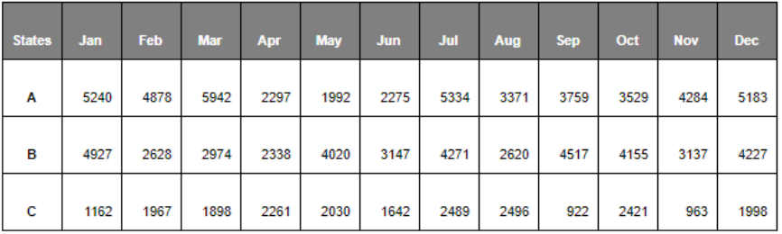

# Staff-Planning-Case-Study

## Problem Introduction
The insurance approval process, i.e., underwriting is one of the important and time-consuming tasks in an insurance application processing. When you submit your insurance application, the underwriter of the company evaluates it based on the details that you provide using a rule-based or an ML model and decides whether or not to approve your application. You can refer to this link for a better understanding of the underwriting process though it is not pertinent to the case study.

 

An insurance company InsurePlus wants you to help them with finding the optimal number of staff that they need for their insurance application approval process for the calendar year 2021.  In the industry, the number of staffs is considered as a continuous variable. This is also called a Full-Time Equivalent (FTE) of the staff. For example, if a full-time employee (FTE =1) works for 50 hours a week, 10 hours corresponds to 0.2 FTEs. If the pay for 50 hours a week is $5000, then 0.2 FTE who may be a part-time employee will be paid $1000 (5000*0.2). You can read about the concept of a full-time equivalent here. In this case study, you have been provided with the information that follows.

 

Note: Go through each and every point carefully to not miss out on any information.

 

## Problem statement & background
- The company operates in three states: A, B and C. The state-wise demand for insurance for the year is shown in the table provided below:
                   

 

- The company can either handle an application with the staff that they hire or outsource it to a vendor. Assume that there is no capacity limitation to outsourcing.
- If they hire staff, he/she can handle 40 insurance applications per month when he/she works 100% of the workdays. However, there are days that he/she will be unavailable to process applications due to training, off days, etc. 
- A staff member’s availability (in percentage) to work on processing the insurance applications for each month is shown in the table given below. As mentioned before, with 100% availability, each member can handle 40 applications.
          
       
A special note of practical relevance: In the industry, staff availability is predicted using a time-motion study. But in this case, you have been given fixed numbers for each month in the table above. You can read more about the time-motion study here if you are curious but please note that it is not required to solve the case study.

 

- States A and B have a regulatory restriction that the outsourced insurance applications cannot be more than 30% and 40% of the total number of applications for each month, respectively. 
- The table given below shows the cost of the staff vs external resources:
                                             

 

The objective is to optimise the total cost for the application approval process by distributing the right number of applications between the FTEs and the vendors while meeting the monthly demand for each state at the same time.

 

## Questions
Now, based on the details provided, you need to answer the following questions given in the dropdowns. The title of the dropdown contains the questions and the dropdowns themselves contain some information relevant to the question.

 

Q1. The company wants to know the optimised staffing recommendations for the business case described.  Write the mathematical model for the deterministic optimisation problem. Define and explain your decision variables, objective function and the constraint.
Hint: Use months of the year as the model timeline. Staff FTE (staff full-time equivalent) can be treated as a continuous variable.

Q2. Code the problem in Python using any optimisation package of your choice.
Note: Add comments to your code to explain each step.

Q3. The company also wants to know the staffing recommendations for the worst-case and best-case scenarios. As mentioned earlier, there are days that an employee will be unavailable to process applications due to training, off days, etc. This will affect employee availability.

Let’s say you have the data for the minimum and maximum availability of the employees for each month, as shown in the table given below.

 

    

 

Assuming that the distribution is the same across all the states, answer the following questions:

- What is the optimal number of staff members for the worst and best cases? 
- What are the percentages of outsourcing for the worst and best cases? 
- What is the average cost per application for the worst and best cases?

Q4. Create the following visualisations using your preferred method (i.e. Python, PowerPoint, Excel, etc.) and add it to your report. 
- Use the solution of Q2 to create a stacked column chart that shows the percentage of applications processed by the staff and by the vendor for each month (%staff processed applications + %vendor processed applications should add up to 100%). 
- Create a graph to show how the cost per application increases with respect to any change in the parameters in your analysis. (Hint: Use the cost per application that you calculate in Questions 2 and 3, i.e., the actual scenario, best case, and worst case.)